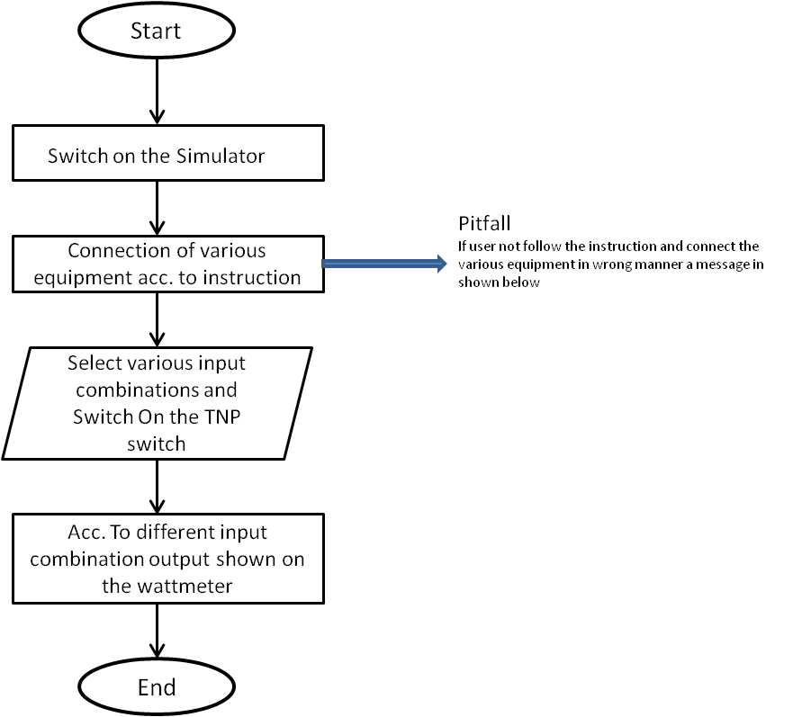
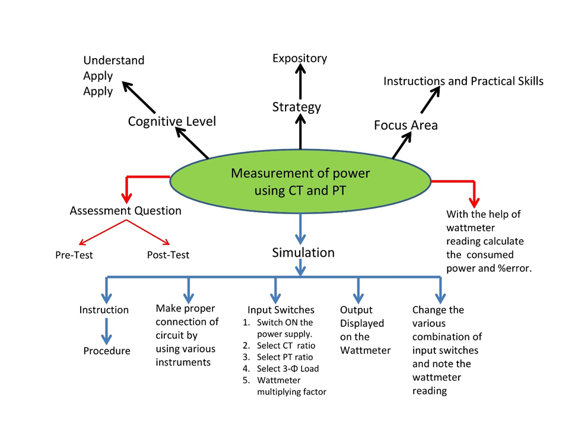

## Storyboard (Round 2)

Experiment 1: Measurement of power using CT and PT  

### 1. Story Outline:

This experiment is based on the measurement of power in 3-phase circuit by using CT and PT. The formula for calculation of power in 3-phase required four values by this method i.e. CT ratio, PT ratio, two element wattmeters reading and the wattmeter multiplying factor.  
The different values of CT ratio, PT ratio, 3-phase load, and wattmeter multiplying factor is fixed along with radio button in the simulator. By selecting the different combinations user will get the output at two element watt meters. By using these readings finally, the user would calculate the 3-phase power of the circuit and error generated by using the formula after noting the reading of two element wattmeter. 
The simulator will perform operations in interaction with user, and the value of power consumed by 3-phase load is calculated and finally the %error. 

### 2. Story:

This experiment is based on the measurement of power in 3-phase circuit by using CT and PT. This experiment uses CTs and PT because in 3-phase circuit the value of current and voltages is very high so we cannot directly use the same voltage and current for the measurement of power. Therefore , have to use calibrated values to take readings and finally multiplied by their factor to obtain the actual power consumed and also the %error. 
When user clicks on the simulation button, simulator for the measurement of power by CT and PT opens up. The simulator screen is partitioned into five areas namely working area, Power and equipment area, instruction area, input switches variable area and last wattmeter reading area. 
First the working area is the space provided in the simulator so that user place the equipment and draw the circuits according to the instruction shown in the instruction area. In starting there is no equipment in the working area. Then from power and equipment area user firstly switch on the simulator and then select different equipment to completer the circuit. Power button  is of green colour, TNP switch- green colour, Potential transformer- Grey colour, current transformer- light blue and pink colour, 3-Φ variable load- yellow colour, , 3-Φ two element wattmeter- red color and last connecting wires- blue colour.  There is input switch variable area having five variables and ten number of switches. And last the id wattmeter reading area which the the output in both analog and digital form.
 
Now user with the help box starts connecting the circuits and after proper connection switch on the power supply. After that different values of CT ratio, PT ratio, 3-phase load, and wattmeter multiplying factor is fixed along with radio button in the simulator. By selecting the different combinations user will get the output at two element watt meters. By using these readings finally, the user would calculate the 3-phase power of the circuit and error generated by using the formula after noting the reading of two element wattmeter.  
#### 2.1 Set the Visual Stage Description:
When the user enters the simulator, he sees a screen divided into 2 columns consisting of two and three rows individually. That indicates that a total of five blocks. 
The first block contains our main canvas (circuit board). The circuit equipment contain TNP Switch, Potential Transformer,  two Current Transformer, Wattmeter and 3-phase variable load along with connecting wires. The wires are colored in subsequent red, blue and yellow colors to be specific and elaborative. 
The second column, the first-row instructions appear as soon as everyone presses the button (follow the instructions) they change subsequently. Below that contains all the buttons of each specified equipment to input the various combinations. In the second column,  
In, the first-row instructions appear as soon as everyone presses the button (follow the instructions) they change subsequently.
Instructions are as follows: 
Step 1: Click on the ON button to start the Simulator. 
Step 2: Now click on switch 
Step 3: connect the components by clicking on their specified buttons. 
Step 4:  connect the wires 
Step 5: change input to see corresponding output in wattmeter 
In the second block user has to give specified inputs of TNP Switch, Potential Transformer Ratio, Current Transformer Ratio, Wattmeter Multiplying Factor and 3-phase variable load.  
And then see the output on the visual wattmeter given in the last row of second column.
 

#### 2.2 Set User Objectives & Goals:
The main objective of this experiment is to calculate the power consumed in 3-Phase load with the help of CT, PT and 3-Phase two element wattmeter.  
At the end of the module user would be able to understand:  
1. Connection of CT, PT and wattmeter in the 3-Phase circuit for calculation of power consumed.  
2.  To Calculate the power consumed in a 3-Phase circuit using wattmeter reading. 
3. Finally, Calculate the % Error in power calculated and actual power consumed. 

#### 2.3 Set the Pathway Activities:
Path:  
1.User follows the instructions and creates the circuit. 
(Step 1: Click on the ON button to start the Simulator.   
Step 2: Now click on switch and follow the instruction as appears in instruction box.  
Step 3: connect the components by clicking on their specified buttons. 
Step 4:  connect the wires 
Step 5: change input to see corresponding output in wattmeter. 
2. User give the specified inputs and then hits the run button. 
TNP Switch (ON/OFF), Potential Transformer Ratio (440/220V,440/110V), Wattmeter Multiplying Factor (2,4). 3-phase Multiplying Factor (500-Watt,100-Watt). 
3. Then the user sees a deflection on the wattmeter (0-125).  

##### 2.4 Set Challenges and Questions/Complexity/Variations in Questions:

1.	How CT and PT are connected in the 3-Phase circuit for measurement of power?  
A.	parallel and series  
B.	series and series 
C.	parallel and parallel 
D.	series and parallel 

      2. What is the ratings of CT and PT? 
A.	10/5 A and 440/220 V 
B.	20/5A and 440/200 V 
C.	5/5A and 440/150 V 
D.	100/5A and 440/100 V 

  
3.	What is the formula for calculating the power of 3-Phase Load? 
A. P=(CT Ratio* PT Ratio* Multiplying factor*Wattmeter Reading) 
B. (CT Ratio* PT Ratio* Multiplying)/ Wattmeter Reading 
C. (PT Ratio* Multiplying factor*Wattmeter Reading)/ CT Ratio 
D. (CT Ratio * Multiplying factor*Wattmeter Reading)/ PT Ratio 

4.	 What is the parameter to be recorded for calculating the % error? 

##### 2.5 Allow pitfalls:
Whenever a student tries to do something wrong. i.e not according to the instructions. He will get a bottom up message on the tab to make it right along with the instructions.  

##### 2.6 Conclusion:
The user after using this simulator were able to know how to make connection for measurement and calculation of power in the 3-Φ load circuit. To make different combinations of the input variables and observe the output of wattmeter user will take nearly 10-15mins to proper understand and run the simulator. The simulator mainly focus on the instrumentation and practical skills learned by the user. Learning objective like how to make connection and power calculation of 3- Φ load by using CT and PT  is achieved by the designed simulator. And finally the total power consumed and %error also

##### 2.7 Equations/formulas: NA
	Calculated Power,P=CT ratio*PT ratio*Multiplying Factor of Wattmeter*Two element Wattmeter Reading  
	Two element Wattmeter Reading+Error=3-Φ Selected Variable Load/(CT ratio*PT ratio*Multiplying Factor of Wattmeter) 
% Error=(Actual Power-Calculated Power)*100/Actual Power 

### 3. Flowchart 4
 

 

### 4. Mindmap:
  

### 5. Storyboard :
  
  
  
  
